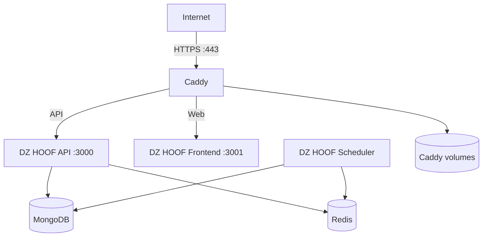

# دليل نشر DZ HOOF في الإنتاج

هذا الدليل يشرح نشر منصة **DZ HOOF** على خادم Linux باستخدام Docker Compose وCaddy للحصول على HTTPS تلقائيًا. المنصة مخصصة للمصادر التي يملك المشغّل حق استخدامها؛ لا تُرفق معها قنوات أو اشتراكات جاهزة.

> لا تبدأ النشر العام قبل ضبط أسرار قوية، وتحديد نطاق HTTPS حقيقي، واختبار النسخ الاحتياطي والاستعادة على نسخة منفصلة.

## البنية الإنتاجية



يُستخدم الملف `server/docker-compose.production.yml` لنشر الصور الجاهزة. أما التطوير المحلي فيستخدم `server/docker-compose.yml`. لا تخلط بين الملفين، ولا تشغّل MongoDB أو Redis على منافذ عامة.

## المتطلبات

| العنصر | الحد الأدنى | الموصى به |
| --- | ---: | ---: |
| النظام | Ubuntu 22.04 LTS | Ubuntu 24.04 LTS |
| الذاكرة | 2 GB | 4 GB أو أكثر |
| المعالج | 2 vCPU | 4 vCPU |
| التخزين | 20 GB | 40 GB SSD |
| الشبكة | نطاق يشير إلى الخادم | نطاق + Cloudflare أو جدار ناري |

يجب تثبيت Docker وDocker Compose Plugin، وفتح المنفذين `80/tcp` و`443/tcp` فقط للعامة. يفضّل تقييد SSH إلى عناوين الإدارة المعروفة.

## 1. الحصول على المشروع

```bash
sudo mkdir -p /opt/dzhoof
sudo chown "$USER":"$USER" /opt/dzhoof
git clone https://github.com/merci1994dz/dzhoot.git /opt/dzhoof
cd /opt/dzhoof/server
```

استخدم release أو commit محددًا في الإنتاج بدل الاعتماد على `main` المتحرك:

```bash
git checkout <RELEASE_COMMIT_OR_TAG>
```

أنشئ شبكة Docker الخارجية المطلوبة مرة واحدة:

```bash
docker network create dzhoof-shared-network 2>/dev/null || true
```

## 2. DNS وHTTPS

أنشئ سجل `A` للنطاق الذي سيخدم الواجهة والـAPI، مثل `tv.example.com`، واجعله يشير إلى عنوان الخادم. لا تستخدم نطاقات المثال الموجودة في الوثائق القديمة.

تحقق من DNS قبل التشغيل:

```bash
dig +short tv.example.com
```

يستخدم Caddy في `docker-compose.production.yml` شهادات ACME تلقائيًا. اضبط القيم التالية في ملف البيئة:

```env
DOMAIN=tv.example.com
ACME_EMAIL=admin@example.com
```

تأكد أن المنفذين 80 و443 متاحان من الإنترنت وأن DNS اكتمل قبل تشغيل Caddy.

## 3. إعداد متغيرات البيئة

ابدأ من القالب الموجود في `server/.env.example`:

```bash
cp .env.example .env
chmod 600 .env
```

ولّد الأسرار بدل كتابتها يدويًا:

```bash
openssl rand -hex 32
openssl rand -hex 32
openssl rand -hex 32
```

الحد الأدنى من إعدادات الإنتاج:

```env
NODE_ENV=production
DOMAIN=tv.example.com
ACME_EMAIL=admin@example.com
APP_URL=https://tv.example.com
PUBLIC_BASE_URL=https://tv.example.com
ALLOWED_ORIGINS=https://tv.example.com

MONGODB_URI=mongodb://mongodb:27017/dzhoof-iptv
REDIS_URL=redis://dzhoof-redis:6379
JWT_ACCESS_SECRET=<32-byte-random-secret>
JWT_REFRESH_SECRET=<32-byte-random-secret>
PLAYBACK_TOKEN_SECRET=<32-byte-random-secret>
XTREAM_SECRET_KEY=<32-byte-random-secret>
TOTP_ENCRYPTION_KEY=<32-byte-random-secret>

SUPER_ADMIN_USERNAME=admin
SUPER_ADMIN_EMAIL=admin@example.com
SUPER_ADMIN_PASSWORD=<strong-password-at-least-16-characters>
SUPER_ADMIN_CHANNEL_LIST_CODE=<random-code-or-leave-empty>
SUBSCRIPTION_REQUIRED=true
TRUST_CF_CONNECTING_IP=false
```

إذا كان الخادم خلف Cloudflare فعلًا، اجعل `TRUST_CF_CONNECTING_IP=true` بعد التأكد من أن كل الطلبات تمر عبر Cloudflare أو proxy موثوق. لا تفعّل هذا الخيار على خادم مكشوف مباشرة للإنترنت.

لإتاحة تحديث APK من GitHub Releases، اضبط `GH_APP_OWNER` و`GH_APP_REPO` و`GH_APP_APK_PATTERN` و`GH_APP_TOKEN` وفق إعدادات المستودع. استخدم token محدود الصلاحيات، ولا تضعه في Git أو في صورة Docker.

## 4. تشغيل الخدمات

تحقق من صحة Compose قبل التشغيل:

```bash
docker compose -f docker-compose.production.yml config >/tmp/dzhoof-compose-validated.yml
```

شغّل الخدمات:

```bash
docker compose -f docker-compose.production.yml up -d

docker compose -f docker-compose.production.yml ps
```

الخدمات الأساسية هي `caddy` و`api` و`frontend` و`mongodb` و`redis` و`scheduler`. لا تُعدّل `container_name` أو اسم الشبكة المشتركة دون مراجعة `REDIS_URL` وملفات الـproxy.

راقب الإقلاع:

```bash
docker compose -f docker-compose.production.yml logs -f --tail=200 api frontend caddy
```

## 5. فحوص الصحة بعد النشر

نفّذ فحوص liveness وreadiness منفصلة:

```bash
curl --fail-with-body https://tv.example.com/health/live
curl --fail-with-body https://tv.example.com/health/ready
curl --fail-with-body 'https://tv.example.com/health?details=true'
```

يجب أن ينجح `/health/live` إذا كانت العملية تعمل، بينما يجب ألا يُعتبر `/health/ready` ناجحًا قبل اتصال MongoDB وRedis المطلوبين. لا تنشر استجابة `details=true` للعامة دون الحاجة؛ استخدمها من شبكة الإدارة أو خلف حماية مناسبة.

بعدها افتح الواجهة، سجّل دخول المشرف، وأنشئ مصدر M3U مصرحًا به. اختبر تشغيل قناة واحدة، الاقتران عبر PIN، EPG، المفضلة، وانتهاء الاشتراك قبل دعوة مستخدمين حقيقيين.

## 6. النسخ الاحتياطي والاستعادة

أنشئ مجلدًا لا يكون داخل volume التطبيق:

```bash
sudo install -d -m 700 /var/backups/dzhoof
sudo chown "$USER":"$USER" /var/backups/dzhoof
```

مثال نسخ MongoDB من خدمة Compose:

```bash
#!/usr/bin/env bash
set -euo pipefail

BACKUP_DIR=/var/backups/dzhoof
STAMP=$(date -u +%Y%m%dT%H%M%SZ)
mkdir -p "$BACKUP_DIR"

docker compose -f /opt/dzhoof/server/docker-compose.production.yml \
  exec -T mongodb mongodump --db=dzhoof-iptv --archive \
  | gzip > "$BACKUP_DIR/mongodb-$STAMP.archive.gz"

find "$BACKUP_DIR" -type f -name 'mongodb-*.archive.gz' -mtime +14 -delete
```

احفظ نسخة مشفرة خارج الخادم، واختبر الاستعادة دوريًا على MongoDB منفصل. لا تعتبر وجود ملف backup دليلًا على نجاح النسخ؛ يجب فحص حجمه ونجاح فك ضغطه:

```bash
gzip -t /var/backups/dzhoof/mongodb-<STAMP>.archive.gz
```

## 7. التحديث والتراجع

قبل كل تحديث:

```bash
cd /opt/dzhoof
 git fetch --tags origin
 git checkout <NEW_RELEASE_TAG>
cd server
docker compose -f docker-compose.production.yml config >/dev/null
docker compose -f docker-compose.production.yml pull
docker compose -f docker-compose.production.yml up -d
docker compose -f docker-compose.production.yml ps
```

راقب `/health/ready` والسجلات بعد التحديث. للتراجع، أعد `DOCKER_IMAGE` و`DOCKER_FRONTEND_IMAGE` إلى الصور السابقة أو checkout إلى tag سابق ثم نفّذ `up -d` من جديد. لا تحذف volumes أثناء التراجع.

## 8. إعادة التشغيل التلقائي

تحتوي Compose على `restart: unless-stopped`. إذا احتجت وحدة systemd لإدارة المكدس، استخدم مسار DZ HOOF لا اسم FireVision:

```ini
# /etc/systemd/system/dzhoof.service
[Unit]
Description=DZ HOOF production stack
Requires=docker.service
After=docker.service

[Service]
Type=oneshot
RemainAfterExit=yes
WorkingDirectory=/opt/dzhoof/server
ExecStart=/usr/bin/docker compose -f docker-compose.production.yml up -d
ExecStop=/usr/bin/docker compose -f docker-compose.production.yml down
TimeoutStartSec=0

[Install]
WantedBy=multi-user.target
```

فعّلها بعد التحقق من مسار Docker:

```bash
sudo systemctl daemon-reload
sudo systemctl enable --now dzhoof
systemctl status dzhoof
```

## 9. تحديث APK

مسار الإصدار المعتمد هو workflow الموجود في `.github/workflows/release-candidate.yml` للإصدارات المرشحة. أما إصدار tag النهائي فيجب أن يمرر `DZHOOF_API_URL` ويستخدم اسم APK يبدأ بـ`dzhoof-`. لا ترفع APK يدويًا إلى Git؛ استخدم GitHub Releases أو artifacts الخاصة بـActions.

## 10. قائمة ما قبل الإطلاق

| الفحص | الحالة |
| --- | --- |
| نطاق HTTPS حقيقي وشهادة صالحة | ☐ |
| `ALLOWED_ORIGINS` لا يحتوي نطاقات تطوير | ☐ |
| الأسرار قوية وغير موجودة في Git | ☐ |
| MongoDB وRedis غير منشورين للعامة | ☐ |
| `/health/live` و`/health/ready` ناجحان | ☐ |
| مصدر M3U مصرح به تم اختباره | ☐ |
| الاقتران وEPG والتشغيل وانتهاء الاشتراك مجربة | ☐ |
| backup ناجح واستعادة تجريبية موثقة | ☐ |
| سجل التحديث والتراجع معروف للفريق | ☐ |
| APK مبني بعنوان API HTTPS صحيح | ☐ |
| مراقبة Sentry والسجلات مفعلة دون أسرار | ☐ |

## استكشاف الأخطاء

| المشكلة | الفحص الأول |
| --- | --- |
| Caddy لا يحصل على شهادة | تحقق من DNS والمنفذين 80/443 و`ACME_EMAIL` |
| API غير جاهز | `docker compose ... logs api mongodb redis` ثم افحص `/health/ready` |
| الواجهة لا تصل إلى API | راجع `ALLOWED_ORIGINS` وCaddyfile و`NEXT_PUBLIC_API_URL` أثناء البناء |
| Redis يرفض الاتصال | تحقق من `REDIS_URL` واسم الخدمة `dzhoof-redis` والشبكة المشتركة |
| APK لا يتصل | تحقق من `DZHOOF_API_URL` وأنه HTTPS قابل للوصول من الجهاز |
| تحديث APK لا يظهر | راجع GitHub Release و`GH_APP_APK_PATTERN` وtoken المحدود |
| استعادة Mongo تفشل | اختبر الأرشيف بـ`gzip -t` ثم استعده على قاعدة منفصلة أولًا |
